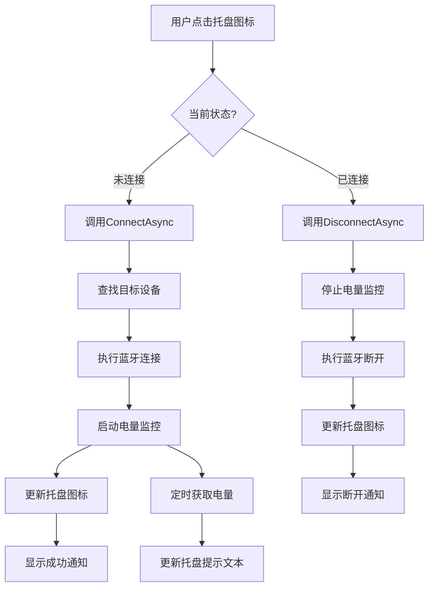

# 蓝牙耳机快速连接工具 - 技术方案

## 一、项目概述

### 1.1 项目目标
开发一个轻量级的Windows系统托盘工具，实现：
- 一键连接/断开指定蓝牙耳机
- 实时显示耳机电量
- 系统托盘常驻，快速访问
- 为后续扩展预留架构（多设备管理、音频路由、编码格式显示等）

### 1.2 核心需求
- **体积小**：最终可执行文件 < 10MB
- **内存占用低**：运行时内存 < 30MB
- **响应快**：连接操作 < 3秒
- **稳定性**：7x24小时稳定运行
- **可扩展**：模块化设计，便于功能扩展

## 二、技术方案选型

### 2.1 推荐方案：C# + WinForms + .NET 6/7
**选择理由：**
1. **体积优势**：
   - 单文件发布 + Trimming + AOT编译 ≈ 5-8MB
   - 运行时内存占用 15-25MB
   
2. **Windows集成度高**：
   - 原生Windows API调用
   - 完善的蓝牙支持（Windows.Devices.Bluetooth）
   - 系统托盘API成熟

3. **性能优秀**：
   - 编译型语言，执行效率高
   - 低级别系统调用，响应快

4. **可扩展性强**：
   - 面向对象，模块化设计
   - 丰富的第三方库生态
   - 易于集成音频处理功能

5. **开发效率**：
   - Visual Studio开发体验好
   - 成熟的调试工具
   - 丰富的文档和社区支持

### 2.2 备选方案对比

| 技术栈 | 体积 | 内存 | 性能 | 开发难度 | 扩展性 | 推荐度 |
|--------|------|------|------|----------|--------|--------|
| C# + .NET | 5-8MB | 15-25MB | ⭐⭐⭐⭐⭐ | ⭐⭐⭐⭐ | ⭐⭐⭐⭐⭐ | ✅ **推荐** |
| Python + PyQt | 50-80MB | 40-60MB | ⭐⭐⭐ | ⭐⭐⭐⭐⭐ | ⭐⭐⭐⭐ | ❌ 体积大 |
| C++ + Win32 | 1-3MB | 10-15MB | ⭐⭐⭐⭐⭐ | ⭐⭐ | ⭐⭐⭐ | ❌ 开发效率低 |
| Electron + Node | 100-150MB | 100-200MB | ⭐⭐ | ⭐⭐⭐⭐ | ⭐⭐⭐⭐ | ❌ 体积和内存 |
| Rust + Windows-rs | 2-5MB | 10-20MB | ⭐⭐⭐⭐⭐ | ⭐⭐ | ⭐⭐⭐⭐ | ⚠️ 学习曲线陡 |

## 三、系统架构设计

### 3.1 整体架构

```
┌─────────────────────────────────────────┐
│         系统托盘UI层                      │
│  - 托盘图标（显示连接状态）                │
│  - 右键菜单（连接/断开/设置/退出）          │
│  - 气泡通知（连接状态提示）                │
└─────────────────┬───────────────────────┘
                  │
┌─────────────────▼───────────────────────┐
│         业务逻辑层                        │
│  ┌──────────────────────────────────┐   │
│  │  设备管理器 (DeviceManager)       │   │
│  │  - 设备扫描                       │   │
│  │  - 设备缓存                       │   │
│  │  - 配置管理                       │   │
│  └──────────────────────────────────┘   │
│  ┌──────────────────────────────────┐   │
│  │  连接管理器 (ConnectionManager)   │   │
│  │  - 连接/断开控制                  │   │
│  │  - 连接状态监控                   │   │
│  │  - 重连机制                       │   │
│  └──────────────────────────────────┘   │
│  ┌──────────────────────────────────┐   │
│  │  电量监控器 (BatteryMonitor)      │   │
│  │  - 电量读取                       │   │
│  │  - 定时更新                       │   │
│  │  - 低电量提醒                     │   │
│  └──────────────────────────────────┘   │
└─────────────────┬───────────────────────┘
                  │
┌─────────────────▼───────────────────────┐
│         Windows API层                    │
│  ┌──────────────────────────────────┐   │
│  │  蓝牙API封装                      │   │
│  │  - Windows.Devices.Bluetooth     │   │
│  │  - Windows.Devices.Enumeration   │   │
│  └──────────────────────────────────┘   │
│  ┌──────────────────────────────────┐   │
│  │  音频API封装（预留）               │   │
│  │  - CoreAudio API                 │   │
│  │  - MMDevice API                  │   │
│  └──────────────────────────────────┘   │
└─────────────────────────────────────────┘
```

### 3.2 核心模块设计

#### 3.2.1 设备管理器 (DeviceManager)
```csharp
public class DeviceManager
{
    // 扫描附近的蓝牙设备
    Task<List<BluetoothDevice>> ScanDevicesAsync();
    
    // 获取已配对设备列表
    Task<List<BluetoothDevice>> GetPairedDevicesAsync();
    
    // 根据名称/地址查找设备
    Task<BluetoothDevice> FindDeviceAsync(string identifier);
    
    // 保存/加载用户配置的常用设备
    void SaveFavoriteDevice(BluetoothDevice device);
    BluetoothDevice LoadFavoriteDevice();
}
```

#### 3.2.2 连接管理器 (ConnectionManager)
```csharp
public class ConnectionManager
{
    // 连接设备
    Task<bool> ConnectAsync(BluetoothDevice device);
    
    // 断开设备
    Task<bool> DisconnectAsync(BluetoothDevice device);
    
    // 获取连接状态
    bool IsConnected(BluetoothDevice device);
    
    // 连接状态变化事件
    event EventHandler<ConnectionStatusChangedEventArgs> StatusChanged;
}
```

#### 3.2.3 电量监控器 (BatteryMonitor)
```csharp
public class BatteryMonitor
{
    // 获取设备电量（百分比）
    Task<int?> GetBatteryLevelAsync(BluetoothDevice device);
    
    // 启动定时监控
    void StartMonitoring(BluetoothDevice device, TimeSpan interval);
    
    // 停止监控
    void StopMonitoring();
    
    // 电量变化事件
    event EventHandler<BatteryLevelChangedEventArgs> BatteryLevelChanged;
}
```

### 3.3 数据流程



## 四、项目结构

```
BluetoothHeadsetManager/
├── src/
│   ├── BluetoothHeadsetManager/          # 主项目
│   │   ├── Program.cs                    # 程序入口
│   │   ├── TrayApplication.cs            # 托盘应用主类
│   │   ├── UI/                           # UI相关
│   │   │   ├── TrayIcon.cs               # 托盘图标管理
│   │   │   ├── ContextMenuBuilder.cs     # 右键菜单
│   │   │   └── SettingsForm.cs           # 设置窗口
│   │   ├── Core/                         # 核心业务逻辑
│   │   │   ├── DeviceManager.cs          # 设备管理
│   │   │   ├── ConnectionManager.cs      # 连接管理
│   │   │   ├── BatteryMonitor.cs         # 电量监控
│   │   │   └── ConfigManager.cs          # 配置管理
│   │   ├── Bluetooth/                    # 蓝牙API封装
│   │   │   ├── BluetoothAdapter.cs       # 蓝牙适配器
│   │   │   ├── BluetoothDevice.cs        # 设备模型
│   │   │   └── BluetoothHelper.cs        # 辅助工具
│   │   ├── Models/                       # 数据模型
│   │   │   ├── DeviceInfo.cs             # 设备信息
│   │   │   ├── AppConfig.cs              # 应用配置
│   │   │   └── BatteryInfo.cs            # 电量信息
│   │   ├── Utils/                        # 工具类
│   │   │   ├── Logger.cs                 # 日志记录
│   │   │   └── NotificationHelper.cs     # 通知辅助
│   │   └── Resources/                    # 资源文件
│   │       ├── Icons/                    # 图标资源
│   │       │   ├── connected.ico         # 已连接图标
│   │       │   ├── disconnected.ico      # 未连接图标
│   │       │   └── connecting.ico        # 连接中图标
│   │       └── config.json               # 默认配置
│   └── BluetoothHeadsetManager.sln       # 解决方案文件
├── docs/                                 # 文档
│   ├── architecture.md                   # 架构文档
│   ├── api.md                            # API文档
│   └── user-guide.md                     # 用户指南
├── tests/                                # 单元测试
│   └── BluetoothHeadsetManager.Tests/
├── build/                                # 构建脚本
│   ├── build.ps1                         # PowerShell构建脚本
│   └── publish.ps1                       # 发布脚本
├── .gitignore
├── README.md
└── LICENSE
```

## 五、技术实现要点

### 5.1 蓝牙设备连接

#### 方案1：使用Windows.Devices.Bluetooth（推荐）
```csharp
using Windows.Devices.Bluetooth;
using Windows.Devices.Enumeration;

// 扫描设备
var selector = BluetoothDevice.GetDeviceSelector();
var devices = await DeviceInformation.FindAllAsync(selector);

// 连接设备
var device = await BluetoothDevice.FromIdAsync(deviceId);
var connectionStatus = device.ConnectionStatus;
```

**优点**：
- Windows 10/11原生支持
- API稳定，文档完善
- 异步操作，性能好

#### 方案2：使用InTheHand.Net.Bluetooth（备选）
```csharp
using InTheHand.Net.Bluetooth;
using InTheHand.Net.Sockets;

// 第三方库，跨版本兼容性好
var client = new BluetoothClient();
var devices = client.DiscoverDevices();
```

**优点**：
- 兼容Windows 7+
- 功能更底层，控制粒度细

### 5.2 电量获取

#### Windows蓝牙电量获取
```csharp
// 通过GATT服务获取电量
var gattServices = await device.GetGattServicesAsync();
var batteryService = gattServices.Services
    .FirstOrDefault(s => s.Uuid == GattServiceUuids.Battery);

if (batteryService != null)
{
    var characteristics = await batteryService.GetCharacteristicsAsync();
    var batteryLevel = characteristics.Characteristics
        .FirstOrDefault(c => c.Uuid == GattCharacteristicUuids.BatteryLevel);
    
    var result = await batteryLevel.ReadValueAsync();
    var reader = DataReader.FromBuffer(result.Value);
    int level = reader.ReadByte(); // 0-100
}
```

**备注**：
- 需要设备支持Battery Service (UUID: 0x180F)
- 大多数现代蓝牙耳机支持此标准
- 部分设备可能需要特定的Vendor-specific服务

### 5.3 系统托盘实现

```csharp
public class TrayApplication : ApplicationContext
{
    private NotifyIcon trayIcon;
    private ContextMenuStrip contextMenu;
    
    public TrayApplication()
    {
        // 创建托盘图标
        trayIcon = new NotifyIcon()
        {
            Icon = Resources.disconnected,
            ContextMenuStrip = BuildContextMenu(),
            Visible = true,
            Text = "蓝牙耳机管理器"
        };
        
        trayIcon.Click += OnTrayIconClick;
    }
    
    private ContextMenuStrip BuildContextMenu()
    {
        var menu = new ContextMenuStrip();
        menu.Items.Add("连接耳机", null, OnConnect);
        menu.Items.Add("断开连接", null, OnDisconnect);
        menu.Items.Add(new ToolStripSeparator());
        menu.Items.Add("设置", null, OnSettings);
        menu.Items.Add("退出", null, OnExit);
        return menu;
    }
}
```

### 5.4 配置文件设计

```json
{
  "version": "1.0.0",
  "favoriteDevice": {
    "name": "Sony WH-1000XM4",
    "address": "00:11:22:33:44:55",
    "lastConnected": "2026-01-11T16:30:00Z"
  },
  "settings": {
    "autoStart": false,
    "batteryCheckInterval": 60,
    "lowBatteryThreshold": 20,
    "showNotifications": true,
    "minimizeToTray": true
  },
  "ui": {
    "language": "zh-CN",
    "theme": "system"
  }
}
```

### 5.5 性能优化策略

1. **启动优化**
   - 延迟加载非关键模块
   - 异步初始化蓝牙适配器
   - 缓存设备列表

2. **内存优化**
   - 及时释放未使用的蓝牙连接
   - 使用对象池管理频繁创建的对象
   - 定期清理日志文件

3. **编译优化**
   ```xml
   <PropertyGroup>
     <PublishSingleFile>true</PublishSingleFile>
     <SelfContained>true</SelfContained>
     <RuntimeIdentifier>win-x64</RuntimeIdentifier>
     <PublishTrimmed>true</PublishTrimmed>
     <TrimMode>link</TrimMode>
     <EnableCompressionInSingleFile>true</EnableCompressionInSingleFile>
   </PropertyGroup>
   ```

## 六、扩展功能设计（后期）

### 6.1 多设备管理
```csharp
public class MultiDeviceManager
{
    private Dictionary<string, BluetoothDevice> devices;
    
    // 设备快捷列表
    public List<DeviceProfile> QuickList { get; set; }
    
    // 切换设备
    Task SwitchToDeviceAsync(string deviceId);
}
```

### 6.2 音频路由控制
```csharp
public class AudioRouter
{
    // 设置默认音频输出设备
    void SetDefaultAudioDevice(string deviceId);
    
    // 获取当前音频设备
    AudioDeviceInfo GetCurrentDevice();
}
```

### 6.3 蓝牙编码格式显示
```csharp
public class CodecDetector
{
    // 检测当前编码格式（SBC/AAC/LDAC/aptX等）
    Task<string> DetectCodecAsync(BluetoothDevice device);
    
    // 编码格式变化事件
    event EventHandler<CodecChangedEventArgs> CodecChanged;
}
```

## 七、开发计划

### 阶段1：基础框架（第1-2周）
- [x] 项目结构搭建
- [ ] 托盘UI实现
- [ ] 配置文件管理
- [ ] 日志系统

### 阶段2：核心功能（第3-4周）
- [ ] 蓝牙设备扫描
- [ ] 设备连接/断开
- [ ] 电量获取和显示
- [ ] 状态监控

### 阶段3：优化完善（第5周）
- [ ] 错误处理和重连机制
- [ ] 性能优化
- [ ] 自动启动
- [ ] 单元测试

### 阶段4：发布准备（第6周）
- [ ] 打包发布
- [ ] 用户文档
- [ ] 安装程序
- [ ] 初版发布

## 八、风险评估

### 8.1 技术风险
| 风险项 | 影响 | 概率 | 应对措施 |
|--------|------|------|----------|
| 蓝牙电量API兼容性 | 中 | 中 | 多厂商测试，提供降级方案 |
| Windows版本兼容性 | 低 | 低 | 最低支持Win10，充分测试 |
| 设备连接稳定性 | 高 | 中 | 实现重连机制，异常处理 |

### 8.2 性能风险
| 风险项 | 影响 | 概率 | 应对措施 |
|--------|------|------|----------|
| 内存泄漏 | 高 | 低 | 代码审查，性能测试 |
| CPU占用过高 | 中 | 低 | 异步处理，定时器优化 |

## 九、总结

### 9.1 方案优势
1. **轻量高效**：C# + .NET单文件发布，体积5-8MB，内存占用15-25MB
2. **Windows原生**：完美集成Windows蓝牙API，稳定可靠
3. **易于扩展**：模块化设计，为多设备管理、音频路由等功能预留接口
4. **开发效率**：成熟的技术栈，开发周期可控

### 9.2 关键成功因素
1. 蓝牙连接稳定性
2. 电量获取准确性
3. 用户体验流畅度
4. 资源占用控制

### 9.3 下一步行动
1. 确认技术方案
2. 搭建开发环境
3. 创建项目骨架
4. 实现MVP功能